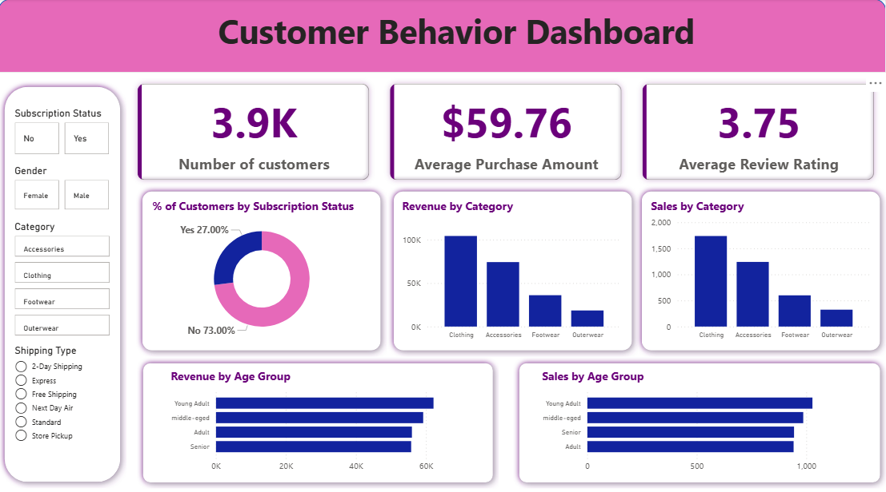

# Customer Shopping Behavior Analysis

## 1. Project Overview
This project analyzes customer shopping behavior using transactional data from 3,900
purchases across various product categories. The goal is to uncover insights into spending
patterns, customer segments, product preferences, and subscription behavior to guide strategic
business decisions.

## 2. Dataset Summary
Rows: 3,900
- Columns: 18
- Key Features:
- Customer demographics (Age, Gender, Location, Subscription Status)
- Purchase details (Item Purchased, Category, Purchase Amount, Season, Size, Color)
- Shopping behavior (Discount Applied, Promo Code Used, Previous Purchases, Frequency of
Purchases, Review Rating, Shipping Type)
- Missing Data: 37 values in Review Rating column

## 3. Exploratory Data Analysis using Python
I began with data preparation and cleaning in Python:
  - Data Loading: Imported the dataset using pandas.
    ```python
    import pandas as pd
    df = pd.read_csv('customer_shopping_behavior.csv')
    ```
  - initial Exploration: Used df.info() to check structure and .describe() for summary statistics.
  - Missing Data Handling: Checked for null values and imputed missing values in the Review Rating column using the median rating of each product category.
    ```python
    df['Review Rating'] = df.groupby('Category')['Review Rating'].transform(lambda x: x.fillna(x.median()))
    ```
  - Column Standardization: Renamed columns to snake case for better readability and documentation.
    ```python
    df.columns = df.columns.str.lower()
    df.columns = df.columns.str.replace(' ', '_')

    df = df.rename(columns={'purchase_amount_(usd)': 'purchase_amount'})
    ```
  - Feature Engineering:
      - Created age_group column by binning customer ages.
      - Created purchase_frequency_days column from purchase data.
        ```python
        # create a column age group
        labels = ['Young Adult', 'Adult', 'middle-eged', 'Senior']
        df['age_group'] = pd.qcut(df['age'], q=4, labels=labels)
        df[['age', 'age_group']].sample(10)

        # create column purchase_frequency_days
        frequency_mapping = {
            'Fortnightly': 14,
            'Weekly': 6,
            'Monthly': 30,
            'Quarterly': 90,
            'Bi-Weekly': 14,
            'Annually': 365,
            'Every 3 Months': 90
        }
        df['purchase_frequency_days'] = df['frequency_of_purchases'].map(frequency_mapping)
        ```
  - Data Consistency Check: Verified if discount_applied and promo_code_used were redundant; dropped promo_code_used.
  - Database Integration: Connected Python script to MySQL and loaded the cleaned DataFrame into the database for SQL analysis.

## 4. Data Analysis using SQL (Business Transactions)
I performed structured analysis in PostgreSQL to answer key business questions:

  - 1. Revenue by Gender – Compared total revenue generated by male vs. female
       customers.
       ```sql
       SELECT 
    	  gender,
    	  SUM(purchase_amount) AS total_revenue
       FROM customer
       GROUP BY gender;
       ```
  - 2. High-Spending Discount Users – Identified customers who used discounts but still spent above the average purchase amount.
       ```sql
       select 
    	    customer_id,
          purchase_amount
       from customer
       where discount_applied = 'Yes' and purchase_amount >= (select avg(purchase_amount) from customer);
       ```
  - 3. Top 5 Products by Rating – Found products with the highest average review ratings.
       ```sql
       select 
        	item_purchased,
           round(avg(review_rating), 2) as average_review_rating
       from customer
       group by item_purchased
       order by avg(review_rating) desc 
       limit 5;
       ```

  - 4. Shipping Type Comparison – Compared average purchase amounts between Standard and Express shipping.
     ```sql
     select 
      	shipping_type,
      	round(avg(purchase_amount), 2) as avg_purchase_amount
    from customer
    where shipping_type IN ('Standard', 'Express') 
    group by shipping_type;
     ```
-5. Subscribers vs. Non-Subscribers – Compared average spend and total revenue across subscription status.
```sql
select 
	subscription_status,
    count(customer_id) as total_customers,
    round(avg(purchase_amount), 2) as avg_spend,
    sum(purchase_amount) as total_revenue
from customer
group by subscription_status;
```
- 6. Discount-Dependent Products – Identified 5 products with the highest percentage of discounted purchases.
  ```sql
  SELECT item_purchased,
       ROUND(100.0 * SUM(CASE WHEN discount_applied = 'Yes' THEN 1 ELSE 0 END)/COUNT(*),2) AS discount_rate
  FROM customer
  GROUP BY item_purchased
  ORDER BY discount_rate DESC
  LIMIT 5;
  ```

  - 7. Customer Segmentation – Classified customers into New, Returning, and Loyal segments based on purchase history.
    ```sql
    with customer_type as(
	select customer_id, previous_purchases,
    CASE 
		WHEN previous_purchases = 1 THEN 'New'
        WHEN previous_purchases BETWEEN 2 AND 10 THEN 'Returning'
        ELSE 'Loyal' 
        END AS customer_segment
	FROM customer
    )
    
    select 
    	customer_segment,
        count(previous_purchases) as nubmer_of_customers
    from customer_type
    group by customer_segment;
    ```

  - 8.Top 3 Products per Category – Listed the most purchased products within each category.
    ```sql
    with top_purchases as (
	select category,
		item_purchased,
        count(customer_id) as total_orders,
        ROW_NUMBER() OVER(PARTITION BY category ORDER BY count(customer_id) DESC) as item_rank
	from customer
    group by category, item_purchased
     )
     select item_rank,
    		category,
    		item_purchased,
            total_orders
     from top_purchases 
     where item_rank <=3;
    ```

  - 9. Repeat Buyers & Subscriptions – Checked whether customers with >5 purchases are more likely to subscribe.
    ```sql
      select
          COUNT(customer_id) as repeate_buyers,
		      CASE WHEN subscription_status = 'Yes' THEN 'Yes' ELSE 'No' END AS subscription_status
    from customer
    where previous_purchases > 5
    group by subscription_status
    order by repeate_buyers desc;
    ```

  - 10. Revenue by Age Group – Calculated total revenue contribution of each age group.
    ```sql
        select age_group,
	      sum(purchase_amount) as total_revenue
    from customer
    group by age_group
    order by total_revenue desc;
    ```

    ## 5. Dashboard in Power BI
    Finally, we built an interactive dashboard in Power BI to present insights visually.
    

    ## 6. Business Recommendations
    - Boost Subscriptions – Promote exclusive benefits for subscribers.
    - Customer Loyalty Programs – Reward repeat buyers to move them into the “Loyal” segment.
    - Review Discount Policy – Balance sales boosts with margin control.
    - Product Positioning – Highlight top-rated and best-selling products in campaigns.
    - Targeted Marketing – Focus efforts on high-revenue age groups and express-shipping users.
